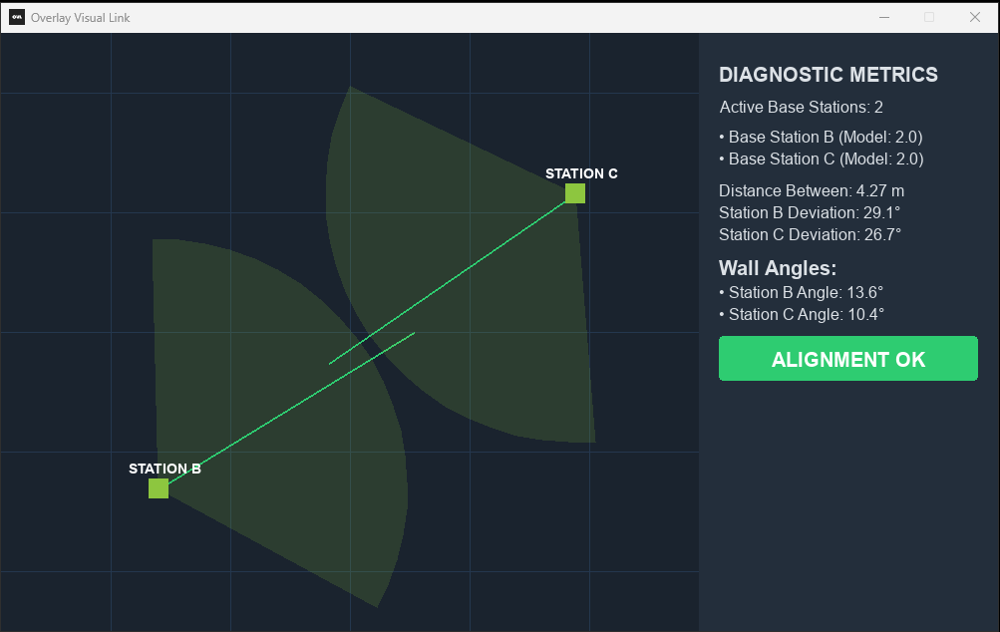

#  OVL Calibrator
### SteamVR Base Station 2D Alignment & Blueprint Mapping Utility

**OVL Calibrator** (Overlay Visual Link) is a lightweight, standalone 2D diagnostic utility built to help VR users perfectly align their HTC Vive or Valve Index Lighthouse base stations. By flattening your 3D room coordinates into an intuitive 2D bird's-eye blueprint grid, you can eliminate controller tracking blind spots with absolute geometric precision.

---

## Features

| Main Tracking Map Features | Dynamic Scanning Features (v1.2) |
| :--- | :--- |
| Live 2D sightline vector map | Infinite multi-point room scanner |
| Dual laser sight projection | Two-point 3D elevation scan |
| Dark greyish-black mode sheet canvas | Live headset and controller tracking nodes |
| Unified component layer alignment | Standby metric data masking |
| Automatic lifecycle standby handlers | Room setup lockout safety protocol |
| Self-contained executable package | Imperial unit conversion matrix |

---

##  Live Metrics & Visualization Dashboard

  

*This preview shows a more updated UI with more features and a new set of stats!*

---

##  How to Download & Run

Because this software carries a strict non-derivative legal security framework, the source code scripts are private. You can download the pre-compiled standalone application directly from the official repository release terminal.

1. Navigate directly to the public [Releases](https://github.com) module link.
2. Download the newest release.
3. Extract the contents directly onto your local Desktop workspace.
4. Turn on your physical VR base stations and wake up **SteamVR**.
5. Launch `ovl_calibrator.exe` and begin aligning!

---

##  Legal License
Distributed under the **Creative Commons Attribution-NonCommercial-NoDerivs 4.0 International (CC BY-NC-ND 4.0)** licensing framework. 
* You are free to copy, share, and redistribute this pre-compiled tool in any medium or format.
* You may **NOT** utilize this material for commercial business profit.
* You are explicitly **forbidden** from reverse-engineering, modifying, or altering the software execution code binary blocks.
